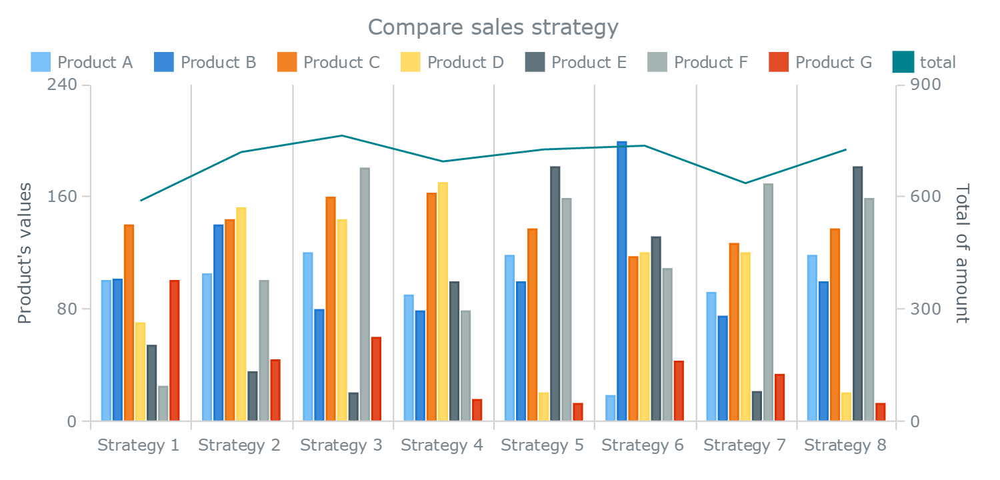

# Original Visualization



## Description

The original visualization compares the performance of several products across different sales strategies. The chart includes multiple bars for different products and a line representing the total values.

## Analysis of the Original Visualization

The visualization contains several design issues. First, the chart includes too many elements, which makes it difficult to interpret. With seven products and eight strategies, the chart becomes cluttered and visually overwhelming.

Second, the use of many colors increases cognitive load and makes comparisons across strategies harder.

Third, the visualization combines a bar chart with a line chart using a secondary axis. Dual-axis charts can lead to confusion because viewers may misinterpret the relationship between the two scales.

---

# Redesigned Visualization 1

This redesign separates the information using faceted charts, making it easier to compare the performance of each product across strategies.

```{r echo=FALSE}
library(ggplot2)

strategy <- rep(paste("S", 1:8), 7)
product <- rep(c("A","B","C","D","E","F","G"), each = 8)

value <- c(
90,95,110,85,108,20,88,108,
92,135,80,78,88,190,75,90,
140,145,160,165,135,120,125,135,
70,150,140,170,25,130,120,25,
60,40,25,95,180,140,30,180,
35,90,180,80,160,110,170,160,
95,50,65,20,18,50,35,15
)

data <- data.frame(strategy, product, value)

ggplot(data, aes(x = strategy, y = value, fill = product)) +
  geom_col(show.legend = FALSE) +
  facet_wrap(~product, ncol = 3) +
  theme_minimal() +
  labs(
    title = "Redesign 1: Faceted Bar Charts",
    x = "Strategy",
    y = "Value"
  ) +
  theme(
    axis.text.x = element_text(angle = 45, hjust = 1)
  )
```
---

# Redesigned Visualization 2

This redesign uses a heatmap to highlight patterns across strategies and products, allowing viewers to quickly identify high and low values.

```{r echo=FALSE}
ggplot(data,aes(strategy,product,fill=value))+
geom_tile()+
scale_fill_gradient(low="lightblue",high="darkred")+
theme_minimal()+
labs(title="Redesign 2: Heatmap")
```
---

# Data Storytelling

The redesigned visualizations reveal clearer patterns in the data. Some strategies perform consistently well across multiple products, while others only perform well for specific products.

---

# Conclusion

The redesigned charts simplify the structure of the visualization and make it easier to compare performance across strategies.

---

# References

Example dataset used for redesign analysis.
---
